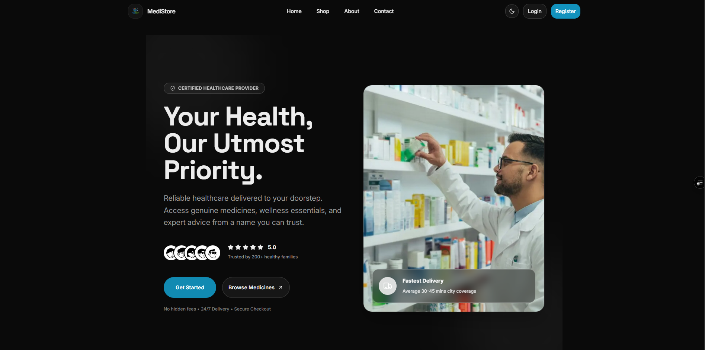
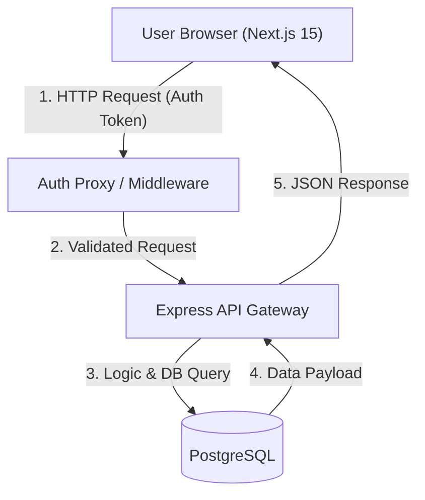
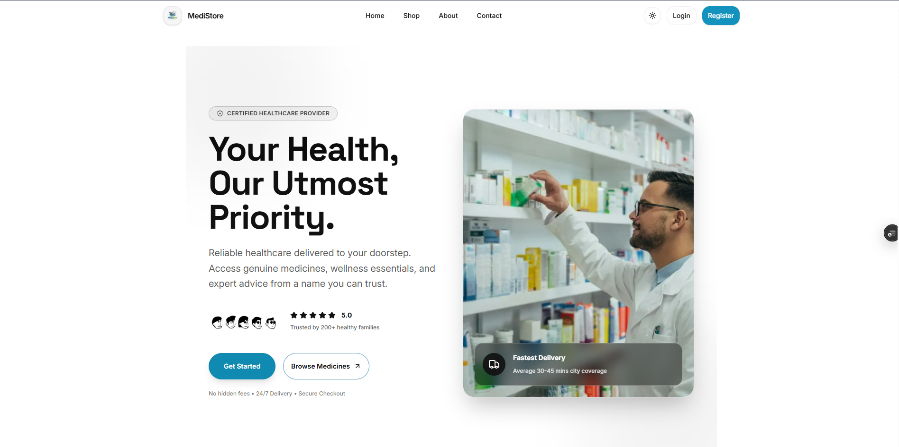
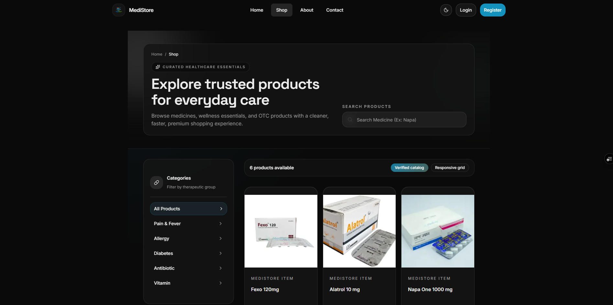
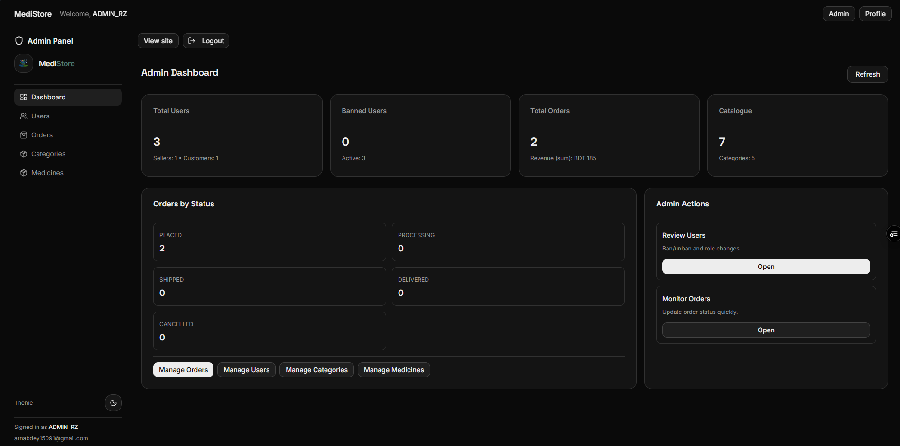
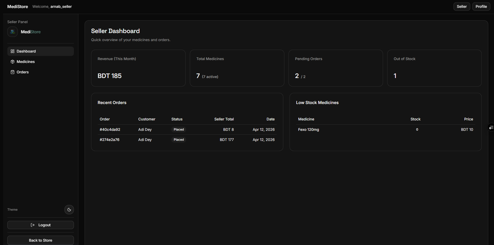
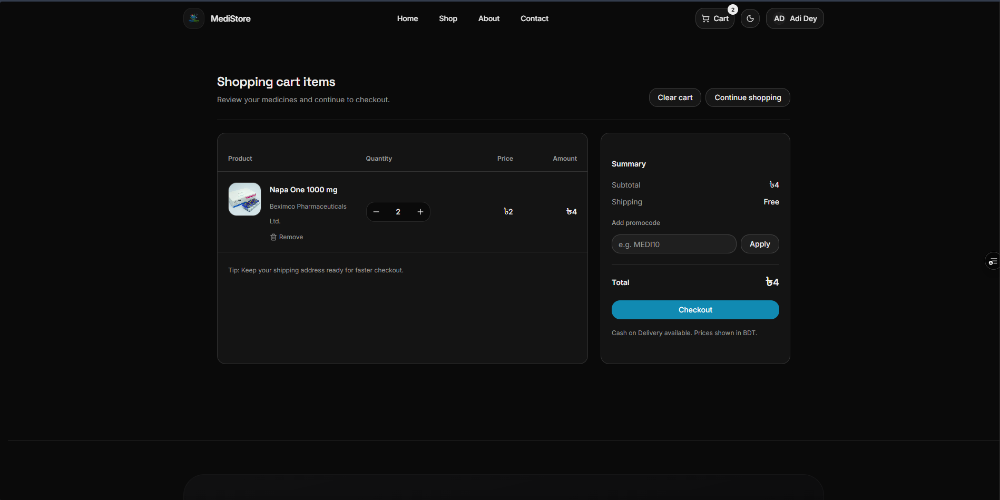
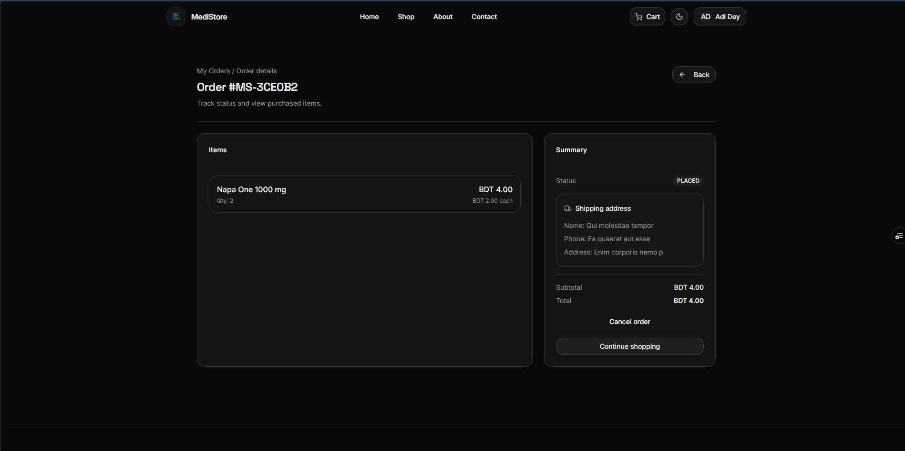
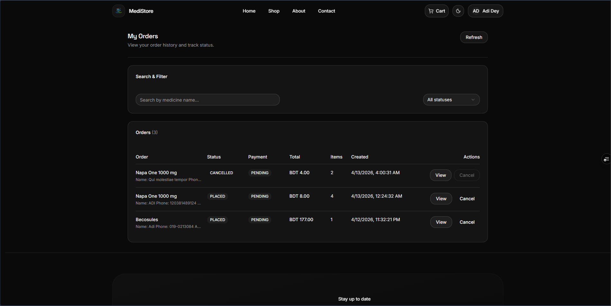

# MediStore 💊 — Digital Healthcare Platform

**A full-stack, production-grade online pharmacy platform built with modern system design principles.**



[](https://nextjs.org/)
[](https://www.typescriptlang.org/)
[](https://tailwindcss.com/)
[](LICENSE)
[](https://medi-store-frontend-rhn6xnvoe-arnabsagas-projects.vercel.app)

---

### 🌐 [Live Demo](https://medi-store-frontend-rhn6xnvoe-arnabsagas-projects.vercel.app) • 📖 [API Documentation](#-api--data-flow) • 🏗️ [Architecture](#-architecture-diagram)

> [!IMPORTANT]
> **Demo Note**: The production environment is connected to a live staging API. Some transaction features (like real-time delivery tracking) may be simulated for demonstration purposes.

---

## 🚀 Why MediStore?

Traditional pharmacy ecosystems often suffer from **fragmented inventory**, a **lack of real-time visibility**, and **clunky digital experiences** that fail both the seller and the customer.

MediStore was engineered to solve these core problems by providing a **unified, scalable, and role-driven marketplace**. We bridge the gap between healthcare providers and consumers through:
- **Real-time Inventory Sync**: Eliminating "Out of Stock" surprises during checkout.
- **Role-Based Workflows**: Tailored interfaces for Customers, Sellers, and Administrators.
- **Production-Grade Security**: Ensuring patient and transaction data remains encrypted and valid.

---

## 📦 Product Overview

MediStore is more than just a storefront; it is a **comprehensive healthcare management system** designed for three distinct user segments:

1.  **Customers**: A premium B2C experience for browsing, comparing, and securely purchasing medicines.
2.  **Sellers**: A robust B2B dashboard for inventory management, order fulfillment, and sales analytics.
3.  **Administrators**: A governance layer to manage users, verify medicines, and oversee platform health.

---

## 🧠 System Design Highlights

The project focuses on **Engineering Excellence** and **Scalable Architecture**:
- **Multi-Role Architecture**: Strict separation of concerns for different user types.
- **Stateless API Design**: The frontend communicates with a decoupled backend, ensuring the system is ready for horizontal scaling.
- **Optimistic UI Logic**: Enhanced UX using **Zustand** for state management, making the interface feel instantaneous during inventory and cart actions.
- **Strict API Boundary Enforcement**: Every request passes through a centralized validation layer.

---

## 📊 Role-Based Workflow

| Feature | Customer | Seller | Admin |
| :--- | :---: | :---: | :---: |
| Browse & Search | ✅ | ✅ | ✅ |
| Inventory Management | ❌ | ✅ | ✅ |
| Order Processing | ❌ | ✅ | ✅ |
| User Governance | ❌ | ❌ | ✅ |
| Profile & History | ✅ | ✅ | ✅ |

---

## 🏗️ Architecture Diagram

MediStore follows a **Modern Client-Server decoupling** pattern:



---

## 🔌 API & Data Flow

Our interaction layer is built for **speed and transparency**. Below is an example of our core authentication flow.

### POST `/api/auth/login`

**Request:**
```json
{
  "email": "user@example.com",
  "password": "••••••••"
}
```

**Response:**
| Status | Meaning | Description |
| :--- | :--- | :--- |
| `200 OK` | **সফল লগইন** | Session token issued via HTTP-only cookie. |
| `401 Unauthorized` | **ভুল credentials** | Invalid email or password provided. |
| `422 Unprocessable` | **Validation Error** | Provided data failed Zod schema check. |

---

## ⚡ Performance & Optimization

- **Next.js Server Components (RSC)**: Drastically reduced client-side JavaScript bundle size.
- **Route-Based Code Splitting**: Loading only the necessary code for the active route.
- **Zustand State Isolation**: Preventing unnecessary re-renders in complex UI components (e.g., Dashboards).
- **Planned Upgrade**: Integration of **TanStack Query** for advanced caching and background synchronization.

---

## 📈 Scalability Considerations

MediStore is designed to grow from MVP to Enterprise:
- **Separation of Concerns**: Frontend and API layers are completely decoupled.
- **Stateless Design**: Allows for horizontal scaling of the API layer behind a load balancer.
- **Cachable Assets**: Edge-ready deployment via Vercel for high-speed content delivery.
- **Microservices Ready**: Core business logic (Order, Auth, Inventory) is architecturally grouped for potential future extraction.

---

## 🔐 Security

- **HTTP-Only Cookies**: Protecting sessions against XSS attacks.
- **CSRF Protection**: Enforced via SameSite policies and strict origin checking.
- **RBAC (Role-Based Access Control)**: Middleware-level guarding for `/admin` and `/seller` routes.
- **Input Sanitization**: Multi-layered validation using **Zod** to prevent injection attacks.

---

## 🧑💻 Developer Experience (DX)

- **Type-Safe APIs**: Full TypeScript integration across the boundary ensures zero "undefined" errors.
- **Modular Folder Structure**: Feature-based organization for high maintainability.
- **Reusable UI Primitives**: Component library powered by **shadcn/ui** and **Lucide Icons**.
- **Clean Codebase**: ESLint and TypeScript strict mode enforced for consistency.

---

## 🌍 Deployment Architecture

- **Frontend**: [Vercel](https://vercel.com) (Edge-optimized Next.js Hosting)
- **Backend API**: Node.js/Express (API Layer)
- **Database**: PostgreSQL (Relational persistence)

**Environment Separation**:
- `Development`: Local environment with strict mock capability.
- `Production`: High-availability cluster on Vercel and Managed DB.

---

## ⚖️ Why MediStore?

| Feature | Traditional Pharmacy | MediStore |
| :--- | :---: | :---: |
| **Inventory** | Manual / Laggy | **Real-time Sync** |
| **Accessibility** | Physical / Limited | **24/7 Global Access** |
| **User Roles** | Restricted | **Customer / Seller / Admin** |
| **Security** | Paper-based | **Encryption & RBAC** |

---

## 🖼️ Screenshots

### 1. Home Page - Dark Mode

*The centralized landing page for the marketplace.*

### 2. Home Page - Light Mode

*Explore: Real-time filtering and category-based medicine discovery.*

### 3. Shop Page

*Govern: Administrative control panel for user and category management.*

### 4. Admin Dashboard

*Manage: Seller-centric interface for inventory and stock tracking.*

### 5. Seller Dashboard

*Secure Access: Unified login and registration system with role selection.*

### 6. Cart System

*Order: Streamlined cart and checkout experience with persistent storage.*

### 7. Cart Page

*Responsive: Pixel-perfect layout across desktop, tablet, and mobile.*

### 8. Order Details

*Insights: Data-driven seller dashboard for tracking sales and growth.*

---

## 🛠️ Setup & Installation

### 1. Prerequisites
- **Node.js** (v20.0.0 or higher)
- **pnpm** (v10.0.0 or higher)

### 2. Clone the Repository
```bash
git clone https://github.com/ArnabSaga/Assignment-4-MediStore-Frontend.git
cd MediStore-Frontend
```

### 3. Install Dependencies
```bash
pnpm install
```

### 4. Configuration
Create a `.env.local` file in the root directory:
```env
NEXT_PUBLIC_API_URL=/api/v1
NEXT_PUBLIC_FRONTEND_URL=http://localhost:3000
BACKEND_URL=http://localhost:5000
```

Authentication is exposed through the frontend origin at `/api/auth/*` by a
Next.js `beforeFiles` rewrite to the backend. Browser code should call
same-origin `/api/auth/*` and `/api/v1/*` paths, not backend-direct auth URLs.

### 5. Start Development
```bash
pnpm dev
```

---

## 🔑 Environment Variables

| Variable | Description | Example |
| :--- | :--- | :--- |
| `BACKEND_URL` | Server-only backend origin used by Next.js rewrites and API proxies | `https://api.medistore.com` |
| `NEXT_PUBLIC_API_URL` | Public API base path | `/api/v1` |
| `NEXT_PUBLIC_FRONTEND_URL` | Public frontend origin used for server-side callback URL construction | `https://medistore.example.com` |

---

## 📂 Folder Structure

```bash
src/
 ┣ app/             # App Router (Pages, Layouts, Route Groups)
 ┃ ┣ (auth)/        # Authentication flows
 ┃ ┣ (protected)/   # Admin and Seller dashboards
 ┃ ┗ (public)/      # Storefront, Shop, and Marketing
 ┣ components/      # Feature-scoped UI components
 ┃ ┣ auth/          # Authentication UI
 ┃ ┣ dashboard/     # Management interfaces
 ┃ ┗ ui/            # shadcn/ui shared primitives
 ┣ lib/             # API Clients, Zustand Stores, & Utils
 ┣ hooks/           # Custom React Hooks
 ┣ providers/       # Context Providers (Theme, Auth)
 ┗ types/           # Global TypeScript Definitions
```

---

## 🛣️ Future Roadmap

- [ ] **Stripe Integration**: Online payments and automated billing.
- [ ] **Real-time Tracking**: Live order delivery status via WebSockets.
- [ ] **AI Recommendations**: Personalized medicine suggestions based on history.
- [ ] **Prescription Hub**: Encrypted upload and verification portal.
- [ ] **Mobile App**: Cross-platform React Native companion app.

---

## ⭐ Support the Project

If this project inspired you or helped your workflow, please consider:
- **Starring** the repository 🌟
- **Forking** it to build your own version 🍴
- **Sharing** feedback or opening a PR 🧠

**Let’s build the future of digital healthcare together.**

---

<p align="center">Made with ❤️ by ArnabSaga</p>
